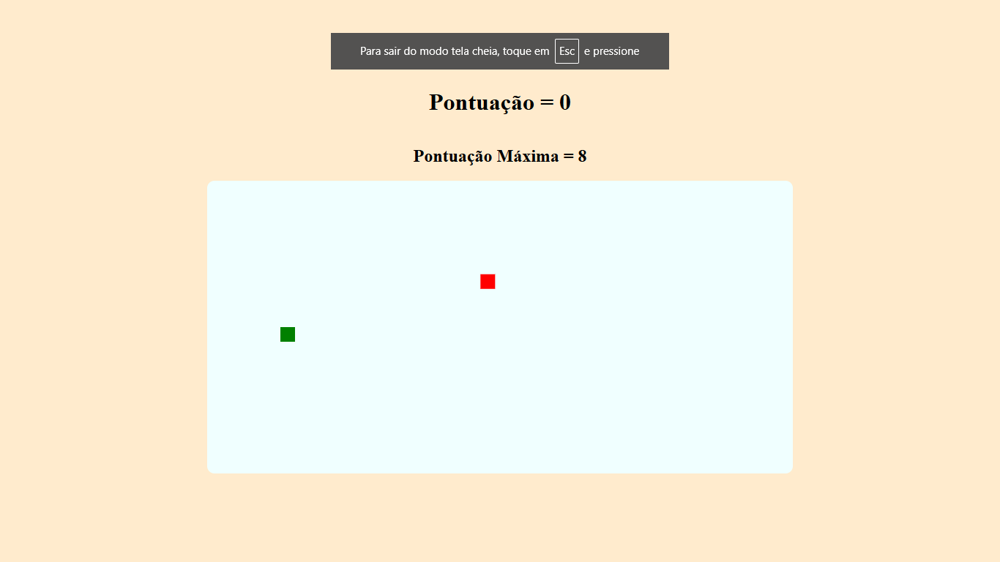

# Jogo da Cobrinha 

Um jogo simples da cobrinha feito com JavaScript.

## Como Jogar

1. Abra o arquivo `index.html` no seu navegador
2. Use as teclas **WASD** ou **setas** para controlar a cobra
3. Coma a comida vermelha para crescer e ganhar pontos
4. Não bata nas paredes nem no próprio corpo!

## Controles

- **W** ou **↑** - Move para cima
- **S** ou **↓** - Move para baixo
- **A** ou **←** - Move para esquerda
- **D** ou **→** - Move para direita

## Como Rodar
Basta abrir o arquivo `index.html` no seu navegador. Não precisa instalar nada!

## Imagens do Jogo

*Jogo da cobrinha em ação*

## Observação

O jogo ainda não está completo. A funcionalidade de fazer a cobrinha crescer ao comer a comida ainda não foi implementada.
(Não consigo pensar em alguma forma com que faça que a cobra aumente de tamanho)